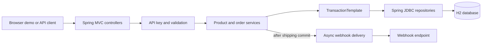

# Catalog Order Service

[](https://github.com/BigFiiish/catalog-order-service/actions/workflows/ci.yml)

A transaction-focused commerce backend built with Java 21, Spring Boot, Spring JDBC, and H2. It demonstrates the failure modes that matter in order processing: concurrent inventory updates, duplicate requests, partial failures, and slow downstream webhooks.

The application also serves a dependency-free browser UI at `http://localhost:8080`, so the reliability behavior can be explored without a separate frontend build.

## What this project demonstrates

- **Atomic inventory updates:** stock is deducted with one conditional SQL statement, preventing the final unit from being sold twice.
- **Transactional order creation:** the order, its line items, and every inventory deduction succeed or roll back together.
- **Idempotent writes:** a caller-supplied idempotency key is protected by a database unique constraint and safely returns the winning order on replay.
- **Deterministic locking order:** duplicate product entries are combined and product IDs are processed in sorted order to reduce deadlock risk.
- **Asynchronous webhooks:** shipping commits before webhook delivery starts; transient failures are retried three times off the request path.
- **Explicit API boundaries:** API-key authentication, request validation, centralized error responses, pagination, and status-specific HTTP responses.

## Architecture



Order creation uses one transaction:

1. Normalize and aggregate requested items by product ID.
2. Snapshot product prices and validate that every product exists.
3. Insert the order and conditionally deduct stock in stable product-ID order.
4. Insert line items and commit, or roll back the entire operation on any failure.
5. Let the database unique constraint resolve concurrent reuse of an idempotency key.

## Tech stack

- Java 21
- Spring Boot 4.1.1
- Spring MVC, Bean Validation, and Spring JDBC
- H2 in-memory database
- JUnit 5, Spring Boot Test, and Mockito
- Maven Wrapper
- Docker multi-stage build
- Vanilla HTML, CSS, and JavaScript demo UI

## Run locally

Prerequisites: Java 21. Docker is optional.

On Windows PowerShell:

```powershell
$env:API_KEY = "local-dev-key"
./mvnw.cmd spring-boot:run
```

On macOS or Linux:

```bash
API_KEY=local-dev-key ./mvnw spring-boot:run
```

Then open [http://localhost:8080](http://localhost:8080) and enter `local-dev-key` in the UI.

If `API_KEY` is omitted, the local-development default is `test-key`. Set a non-default value outside local development.

## Deploy the public demo

The repository includes a Render Blueprint for a free Docker-based web service:

[](https://dashboard.render.com/blueprint/new?repo=https%3A%2F%2Fgithub.com%2FBigFiiish%2Fcatalog-order-service)

The public demo uses the visible `test-key` credential so visitors can interact with the API immediately. The Blueprint disables outbound webhook delivery while keeping the asynchronous shipping path active, preventing a public visitor from turning the demo into an arbitrary HTTP relay. Local runs retain real webhook delivery by default.

The free service uses in-memory H2 data. Inventory and orders reset whenever Render restarts or spins down the instance; this is intentional for a portfolio demo, not a production persistence model.

### Docker

```bash
docker build -t catalog-order-service .
docker run --rm -p 8080:8080 -e API_KEY=local-dev-key catalog-order-service
```

## API

Every `/api/*` request requires an `X-API-Key` header. Creating an order additionally requires `Idempotency-Key`.

| Method | Endpoint | Purpose |
| --- | --- | --- |
| `GET` | `/api/products?page=0&size=20` | Browse the catalog |
| `GET` | `/api/products?category=Home` | Filter products by category |
| `GET` | `/api/products/{id}` | Fetch one product |
| `POST` | `/api/orders` | Create an idempotent order |
| `POST` | `/api/orders/{id}/ship` | Mark an order shipped and enqueue its webhook |

Create an order:

```bash
curl -i -X POST http://localhost:8080/api/orders \
  -H "X-API-Key: local-dev-key" \
  -H "Idempotency-Key: example-order-001" \
  -H "Content-Type: application/json" \
  -d '{"customerEmail":"jane@example.com","items":[{"productId":1,"quantity":2}]}'
```

Replay the same request with the same key to receive the original order without deducting stock again.

Ship an order:

```bash
curl -i -X POST http://localhost:8080/api/orders/1/ship \
  -H "X-API-Key: local-dev-key" \
  -H "Content-Type: application/json" \
  -d '{"webhookUrl":"http://localhost:9999/webhook"}'
```

## Verification

```bash
./mvnw test
```

The test suite covers controllers, repositories, service transactions, rollback behavior, idempotency replay, a real two-thread last-unit race, shipping state transitions, and webhook retry counts.

CI runs the full Maven test suite on Java 21 for every push and pull request.

## Project structure

```text
src/main/java/io/github/bigfiiish/catalog/
├── config/       API-key and async configuration
├── controller/   HTTP endpoints
├── dto/          Request and response contracts
├── exception/    Centralized API errors
├── model/        Domain records and status
├── repository/   Explicit SQL and row mapping
├── service/      Transaction and business rules
└── webhook/      Async delivery and retry logic

src/main/resources/
├── schema.sql    Tables, constraints, and indexes
├── data.sql      Deterministic demo inventory
└── static/       Interactive browser demo
```

Additional SQL notes, including a ranked sales query and the concurrency-safe stock update, are in [`docs/database-notes.sql`](docs/database-notes.sql).

## Scope and production trade-offs

This is intentionally a focused single-service project. H2 keeps the repository easy to run, but a production deployment would use a durable database such as PostgreSQL, database migrations, secret management, structured observability, and stronger authentication. Reliable webhook delivery would normally use an outbox or queue with durable retry state, URL allowlisting, and operational tooling instead of an in-process executor.
